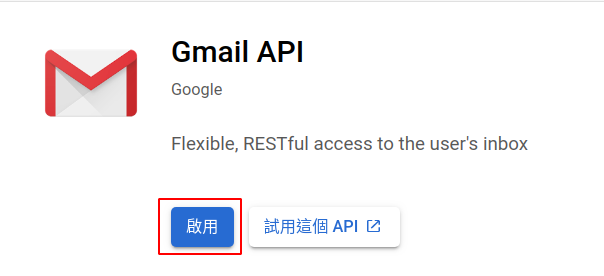

# Smart-Calendar

## Environment

Install numpy

```shell
pip install numpy
```

Install Google Client Library

```sh
pip install --upgrade google-api-python-client google-auth-httplib2 google-auth-oauthlib
```

## Usage

- Google Calendar API

Follow the step of [Google Calendar API Python Quickstart](https://developers.google.com/calendar/quickstart/python) to turn on Google Calendar API


Save the file credential.json to working directory

- Gmail API

Select your project in [Google API Console](https://console.developers.google.com/apis/library/gmail.googleapis.com?q=gmail)


Turn on Gmail API


## Reference

- [Google Calendar API Python Quickstart](https://developers.google.com/calendar/quickstart/python)
- [Gmail API Python Quickstart](https://developers.google.com/gmail/api/quickstart/python)
