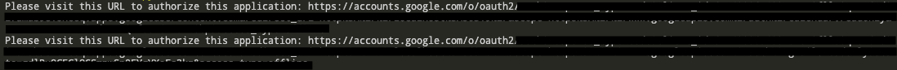
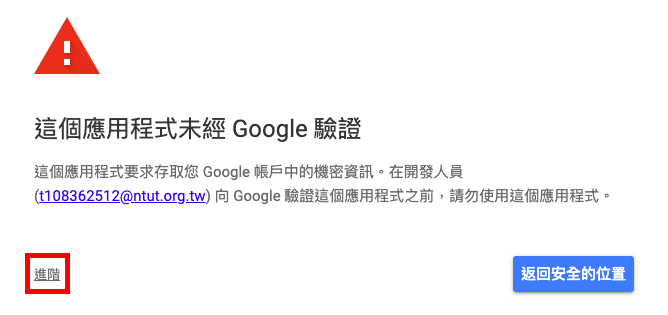
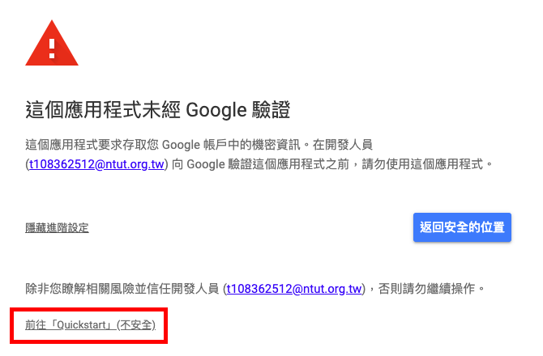

# Smart-Calendar

## Environment

Follow the [build-env.md](./build-env.md) to build environment

## Usage

- Run code

```sh
cd <project-directory>
python gui_main.py
```

Visit URLS on the terminal to authorize calendar and gmail application



1. Login your Gmail account
2. Press "Advance"



3. Press "Go to Quickstart"



3. Press "Access"
4. Press "Access"


## Reference

- [Google Calendar API Python Quickstart](https://developers.google.com/calendar/quickstart/python)
- [Gmail API Python Quickstart](https://developers.google.com/gmail/api/quickstart/python)
