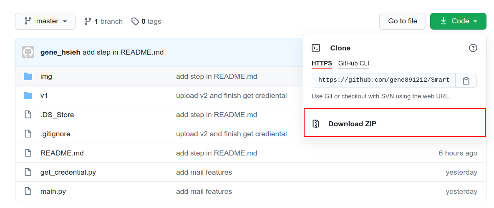
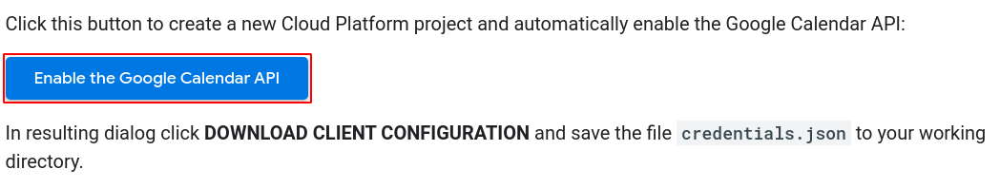
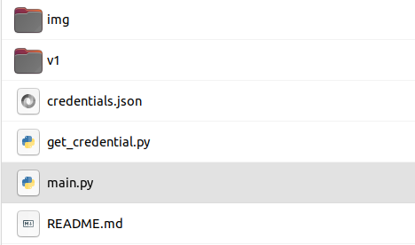
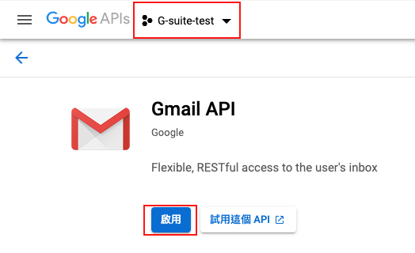

# Build Environment

## Download Project

Select "Download ZIP" and extract the file you download



## Install Python Package

- Install PyQt5

```shell
pip install PyQt5
```

- Install Google Client Library

```sh
pip install --upgrade google-api-python-client google-auth-httplib2 google-auth-oauthlib
```

## Build Google API

- Google Calendar API

Create a new Cloud Platform project in [Google Calendar API Python Quickstart](https://developers.google.com/calendar/quickstart/python)



1. Click the "Enable Google Calendar API" button
2. Enter project name
3. Click "Next"
4. Click "Create"
5. Click "Download client configuration"
6. Put "credential.json" file to your extracted project directory



- Gmail API

Eable Gmail API in [Google API Console](https://console.developers.google.com/apis/library/gmail.googleapis.com?q=gmail)

1. Select your project
2. Enable Gmail API


